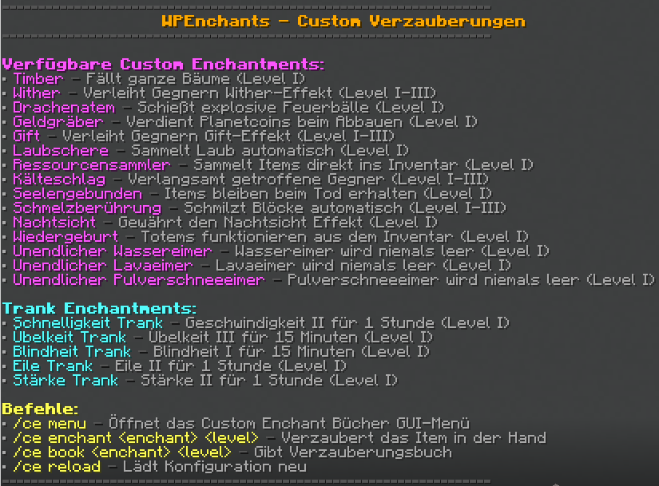

wieso geht das nicht??


# WPEnchants - Custom Enchantments Plugin

Ein umfassendes Custom Enchantments Plugin für Minecraft Paper Server (1.21.+).

## 📋 Übersicht

WPEnchants fügt 21 einzigartige Custom Enchantments zu deinem Minecraft Server hinzu, mit einem benutzerfreundlichen GUI-Menü und vollständiger deutscher Lokalisierung.

### ⚔️ Verfügbare Enchantments

#### Kampf-Enchantments
| Enchantment      | Stufen       | Anwendbar auf   | Beschreibung                              |
|------------------|--------------|-----------------|-------------------------------------------|
| **Whiter**       | I-III (5%, 10%, 15%)  | Alle Schwerter  | Gibt Gegnern Wither-Effekt für 7 Sekunden |
| **Gift**         | I-III (5%, 10%, 15%)  | Alle Schwerter  | Gibt Gegnern Gift-Effekt für 5 Sekunden   |
| **Drachenatem**  | I            | Alle Schwerter  | Schießt Feuerbälle per Rechtsklick (8s Cooldown) |
| **Kälteschlag**  | I-III        | Alle Schwerter  | Gibt Gegnern Langsamkeit-Effekt           |
| **Seelengebunden** | I         | Alle Schwerter  | Item bleibt bei Tod erhalten              |

#### Abbau-Enchantments
| Enchantment      | Stufen       | Anwendbar auf   | Beschreibung                              |
|------------------|--------------|-----------------|-------------------------------------------|
| **Timber**       | I (50 Blöcke)| Alle Äxte       | Baut ganze Bäume ab                       |
| **Laubschere**   | I (75 Laub)  | Scheren         | Baut ganzes Laub ab (3s Cooldown)         |
| **Geldgräber**   | I            | Spitzhacken, Schaufeln | Chance auf Planetcoins beim Block-Abbau |
| **Ressourcensammler** | I      | Tools, Schwerter, Scheren | Sammelt automatisch Ressourcen ein      |
| **Schmelzberührung** | I-III   | Spitzhacken     | Schmilzt Erze direkt beim Abbau           |

#### Spezial-Enchantments
| Enchantment             | Stufen  | Anwendbar auf | Beschreibung                           |
|-------------------------|---------|---------------|----------------------------------------|
| **Nachtsicht**          | I       | Helme         | Permanente Nachtsicht beim Tragen     |
| **Wiedergeburt**        | I       | Totems        | Multi-Use Totem der Unsterblichkeit    |
| **Unendlicher Wassereimer** | I   | Wassereimer   | Unendlich Wasser platzieren            |
| **Unendlicher Lavaeimer** | I    | Lavaeimer     | Unendlich Lava platzieren              |
| **Unendlicher Pulverschneeeimer** | I | Pulverschneeeimer | Unendlich Pulverschnee platzieren |

#### Trank-Enchantments
| Enchantment             | Effekt        | Anwendbar auf  | Beschreibung                              |
|-------------------------|---------------|----------------|-------------------------------------------|
| **Schnelligkeit Trank** | Geschwindigkeit IV | Wasserflaschen | 15 Minuten Speed IV beim Trinken         |
| **Übelkeit Trank**      | Übelkeit III  | Wasserflaschen | 15 Minuten Nausea III beim Trinken       |
| **Blindheit Trank**     | Blindheit I   | Wasserflaschen | 15 Minuten Blindness I beim Trinken      |
| **Eile Trank**          | Eile II       | Wasserflaschen | 1 Stunde Haste II beim Trinken           |
| **Stärke Trank**        | Stärke II     | Wasserflaschen | 1 Stunde Strength II beim Trinken        |
| **Schnelligkeit Lang Trank** | Geschwindigkeit II | Wasserflaschen | 1 Stunde Speed II beim Trinken           |

## 🚀 Installation

### Voraussetzungen
- **Minecraft Server**: Paper 1.21.+
- **Java**: Version 17 oder höher
- **Maven**: Für die Kompilierung (optional)

### Schritt 1: Plugin kompilieren
```bash
git clone <repository-url>
cd WPEnchants
mvn clean package

```
---

## Bilder

Bilder & gifs (Dateinamen in `WPEnchants/images/`):

- **text**
  
  

- **text**

  

- **text**

  

